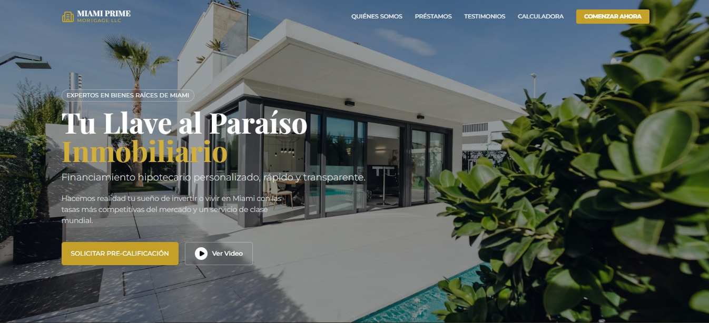
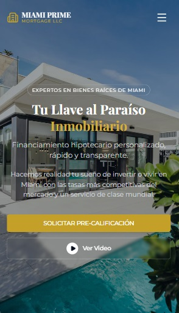

# Miami Prime Mortgage

Bienvenido a **Miami Prime Mortgage**, una plataforma web premium diseñada para el mercado inmobiliario de lujo en Miami. Este proyecto ofrece una experiencia visual inmersiva y herramientas prácticas para potenciales inversores y compradores de vivienda.

## 🚀 Características Principales

- **Diseño Premium & Responsive**: Una interfaz elegante con estética "Gold & Navy", totalmente adaptada a dispositivos móviles y de escritorio.
- **Hero Section Dinámico**: Carrusel de imágenes generadas por IA que muestran propiedades de lujo en Miami, con un modal de video integrado.
- **Calculadora Hipotecaria**: Herramienta interactiva para estimar pagos mensuales.
- **Navegación Fluida**: Menú de navegación intuitivo y secciones bien definidas (Acerca de, Tipos de Préstamos, Contacto).
- **Formulario de Pre-calificación**: Un formulario modal optimizado para la captación de leads.

## 🛠️ Tecnologías Utilizadas

- **React**: Biblioteca principal para la construcción de la interfaz de usuario.
- **TypeScript**: Para un código más robusto y tipado estático.
- **Vite**: Entorno de desarrollo rápido y ligero.
- **Tailwind CSS**: Framework de utilidad para el diseño y estilizado.
- **Framer Motion**: Para animaciones suaves y transiciones de elementos.
- **Lucide React**: Conjunto de iconos vectoriales modernos.

## 📸 Capturas de Pantalla

### Versión de Escritorio



### Versión Móvil



### Landing Page Completa


## 📦 Instalación y Uso

1.  **Clonar el repositorio:**

    ```bash
    git clone <URL_DEL_REPOSITORIO>
    ```

2.  **Instalar dependencias:**

    ```bash
    npm install
    ```

3.  **Iniciar el servidor de desarrollo:**

    ```bash
    npm run dev
    ```

4.  **Construir para producción:**
    ```bash
    npm run build
    ```

## 📄 Estructura del Proyecto

- `/components`: Componentes reutilizables de React (Hero, Navbar, Modal, etc.).
- `/public`: Archivos estáticos como imágenes y favicon.
- `/src`: Código fuente principal.

---

Desarrollado con ❤️ para Miami Prime Mortgage.
